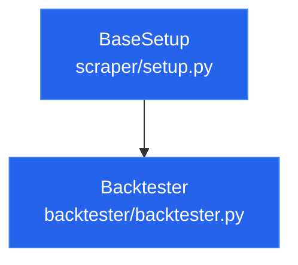

# System Architecture Overview

This document provides a detailed overview of the system architecture of **PocketQuant2**, focusing on the modules, classes, and functions involved in data loading, feature computation, backtesting, and evaluation.

---

## Directory Map

The codebase is organized into several key directories:

```
PocketQuant2/
├── backtester/
│   ├── __init__.py
│   └── backtester.py              # Main Backtester class (inherits from BaseSetup)
├── configs/
│   └── paths.py                   # Centralized path configurations (DATA_RAW, DATABASE_PATH, etc.)
├── execution/
│   ├── data_fetch/
│   │   ├── delete_data_dynamo.py  # Utility to delete option records from DynamoDB
│   │   ├── fetch_data.py          # Daily SQLite price & options fetch script
│   │   └── fetch_data_dynamo.py   # Daily AWS DynamoDB options fetch script
│   ├── logs/                      # Log files generated by execution scripts
│   └── tickers.txt                # Tickers file used by fetch scripts
├── expirments/                    # Historical sandbox and strategy templates
│   ├── silver_trade/
│   │   ├── data_check.py          # Local timezone check script for Silver Futures/ETF
│   │   └── futures.py             # Custom analysis of Futures overnight vs opening spikes
│   ├── find_implied_intrest.py    # Options put-call parity implied rate analyzer
│   ├── getsnp500.py               # Wiki-scraper for S&P 500 component tickers
│   ├── svol_vixy_tailhedge.py     # Event-driven dividend reinvestment hedge backtest
│   └── test_aapl_backtest.py      # Quick execution template for single-ticker backtest
├── models/                        # Machine learning pipelines
│   ├── daily_model/
│   │   ├── daily_base.py          # Baseline test strategy for out-of-sample backtests
│   │   └── xgboost/
│   │       ├── xgboost_model.py   # Binary classifier model for next-day direction
│   │       └── tests/             # Pytest suite validating training logic & leakage
│   └── price_prediction_xgb.py    # Multi-ticker feature training script
├── research/                      # Feature analysis and signal testing
│   ├── evaluate_features.py       # Monotonicity, decay, and regime feature evaluator
│   └── features_test.py           # Feature evaluator test suite runner
├── scraper/                       # API integration and raw processing
│   ├── api_clients/
│   │   ├── AlphaVantage.py        # AlphaVantage API client with request throttling
│   │   └── YFinance.py            # yfinance stock & option scraper
│   ├── features/                  # Math formulas for indicators (RSI, Bollinger, MACD, etc.)
│   ├── utils/
│   │   ├── build_db.py            # SQLite database schemas and CRUD operations
│   │   ├── feature_builder.py     # Merger for multiple computed indicator series
│   │   └── filter.py              # CSV/Parquet time-range and column filters
│   └── setup.py                   # BaseSetup class managing DB/API pipeline flow
└── tests/                         # Main unit test suite
    ├── test_backtester.py         # Exhaustive tests for get_price_data, stats, alpha/beta
    ├── test_real_aapl.py          # Integration test verifying SQLite/CSV state
    └── test_scraper_refactor.py   # Test checking API call bypassing on DB cache hit
```

---

## Core Abstraction and Class Hierarchy

The system is designed around a single inheritance model for backtesting:



### 1. `BaseSetup` ([scraper/setup.py](file:///d:/Files/Code/PocketQuant2/scraper/setup.py))
Responsible for configuring, fetching, cleaning, and storing market data (both stock prices and options) and features.
*   **Attributes**:
    *   `tickers`: List of stock tickers.
    *   `db_path`: Absolute path to the SQLite file.
    *   `features_options`: Dict defining which technical indicators to generate and their parameters.
    *   `data_dict`: Dictionary caching raw DataFrames per ticker (`{ticker: df}`).
    *   `features`: Dictionary caching calculated feature DataFrames per ticker.
*   **Key Pipeline Methods**:
    *   `_fetch_data()`: Check SQLite cache. Pull from API if missing, write back to DB, and populate memory.
    *   `_build_features()`: Run feature calculations and save results as CSV.
    *   `run_pipeline()`: Sequentially run `_fetch_data()` and `_build_features()`.

### 2. `Backtester` ([backtester/backtester.py](file:///d:/Files/Code/PocketQuant2/backtester/backtester.py))
Inherits all data retrieval capabilities from `BaseSetup` and overlays alignment, statistical calculations, and vectorbt backtesting wrappers.
*   **Attributes**:
    *   `portfolio`: Stores the executed `vectorbt.Portfolio` object.
*   **Key Pipeline Methods**:
    *   `get_price_data()`: Returns a wide DataFrame containing prices (e.g., CLOSE) for all tickers.
    *   `get_ticker_features()`: Accesses pre-computed features for a given ticker.
    *   `run_backtest()`: Run a signal-driven portfolio simulation.
    *   `calculate_alpha_beta()`: Calculates metrics versus a benchmark ticker.

---

## Data Flow Pipeline

The flow of data through the system follows a clear caching hierarchy:

```
[API Clients: yfinance / AlphaVantage]
                 │
                 ▼
     [SQLite DB: market_data.db]
                 │
                 ▼
      [BaseSetup: Memory Cache]
                 │
                 ▼
    [Feature Builder: build_features] ──> [CSV Files: data/features/*.csv]
                 │
                 ▼
   [Backtester / Models / Evaluators]
```

1.  **Ingestion**: `BaseSetup` checks `market_data.db`. If data is missing for the requested date range, `StockScraper` fetches data from the web.
2.  **Storage**: Raw price data is saved in SQLite using composite primary keys `(DATE, INTERVAL)`. Option chains are written to `options_data.db`.
3.  **Transformation**: Raw price columns are processed through mathematical functions (under `scraper/features/`) to compute technical indicators.
4.  **Serialization**: Processed features are stored as CSV files under `data/features/{TICKER}_features.csv` for fast inspection and model input.
5.  **Consumption**: The `Backtester` loads the price data and features, aligns the dates, builds signals, and feeds them into `vectorbt`.
