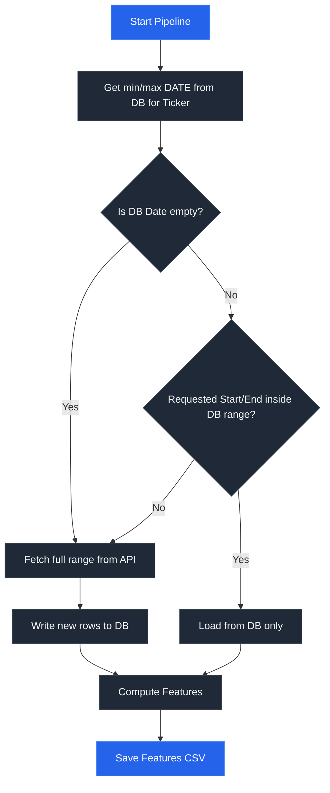

# Market Data & Feature Pipeline

This document explains how market data is fetched, cached in SQLite, and transformed into technical features.

---

## 1. Data Ingestion & Clients

The system supports two data scrapers located in `scraper/api_clients/`:

### A. Yahoo Finance Scraper (`StockScraper` in [scraper/api_clients/YFinance.py](file:///d:/Files/Code/PocketQuant2/scraper/api_clients/YFinance.py))
*   Fetches stock prices and option chains.
*   Uses `auto_adjust=self.adjusted` (default `True` in pipeline, `False` in fetch scripts) and `threads=True` to download data in parallel.
*   Enforces column names in uppercase: `DATE`, `OPEN`, `HIGH`, `LOW`, `CLOSE`, `VOLUME`, and optional `ADJ CLOSE`.
*   Includes client-side retry logic with exponential backoff (up to 3 retries).
*   Handles cleaning via interpolation (`interpolate(method='time')`) and backward filling (`bfill()`) to handle missing bars when `fill_missing=True`.

### B. AlphaVantage Scraper (`StockScraperAV` in [scraper/api_clients/AlphaVantage.py](file:///d:/Files/Code/PocketQuant2/scraper/api_clients/AlphaVantage.py))
*   Fetches daily and intraday prices.
*   Requires a valid `api_key`.
*   Implements strict request throttling (`_throttle()`) to enforce a rate limit of **5 requests per minute** on the free tier.
*   Converts JSON responses from the AlphaVantage endpoints into structured pandas DataFrames.

---

## 2. Database Caching & Schema

Data is cached in SQLite databases to prevent redundant API calls. The DB operations are defined in [scraper/utils/build_db.py](file:///d:/Files/Code/PocketQuant2/scraper/utils/build_db.py).

### A. Market Price Data (`market_data.db`)
Each ticker gets its own table named after the uppercase symbol (e.g., `AAPL`).
*   **Composite Primary Key**: `PRIMARY KEY(DATE, INTERVAL)`
*   **Column Types**: `DATE` is stored as `TEXT` (formatted as `YYYY-MM-DD HH:MM:SS`). `INTERVAL` is stored as `TEXT`. Numeric price columns are stored as `REAL`.
*   **Deduplication**: Handled via `INSERT OR REPLACE` SQL statements. When new data is written to the table, any overlapping row with the same `DATE` and `INTERVAL` is updated.

### B. Options Chain Data (`options_data.db`)
*   **Table Structure**: One table per ticker symbol.
*   **Metadata Columns**: Added during ingestion:
    *   `EXPIRATION`: Expiration date of the contract (`YYYY-MM-DD`).
    *   `OPTION_TYPE`: `calls` or `puts`.
    *   `FETCH_DATE`: Date of fetch (defaults to today's date, or last Friday if fetched on a weekend).
*   **Deduplication**: Instead of throwing errors, the database check reads existing records and generates a composite comparison key string:
    ```python
    key_columns = ['EXPIRATION', 'OPTION_TYPE', 'strike', 'contractSymbol']
    ```
    Rows already present in the table are filtered out, and only new rows are appended. An index is automatically created on `FETCH_DATE` to optimize querying.

---

## 3. Feature Generation & Indicators

Features are mathematical transformations of raw price columns (typically `CLOSE`, `HIGH`, and `LOW`). The individual modules are defined under `scraper/features/`:

| Feature Name | Function Name | Columns Created | Math / Logic |
| :--- | :--- | :--- | :--- |
| **Returns** | `compute_returns` | `RETURN` or `LOG_RETURN` | Percent change (`pct_change()`) or log difference (`np.log(C_t / C_t-1)`) |
| **Moving Averages** | `compute_moving_averages` | `MA_{w}` | Rolling mean of `CLOSE` with window size `w` |
| **Bollinger Bands** | `compute_bollinger_bands` | `BB_UPPER_{w}`, `BB_LOWER_{w}` | Rolling mean $\pm$ (2 $\times$ rolling standard deviation) of `CLOSE` |
| **RSI** | `compute_rsi` | `RSI_{w}` | Wilders Exponential Moving Average ratio of upward and downward price differences |
| **MACD** | `compute_macd` | `MACD_{f}_{s}_{sig}`, `MACD_SIGNAL_{f}_{s}_{sig}` | Fast EMA - Slow EMA of `CLOSE`; Signal line is the EMA of the MACD line |
| **Volatility** | `compute_volatility` | `VOL_{w}` | Rolling standard deviation of daily percent returns |
| **ATR** | `compute_atr` | `ATR_{w}` | Rolling mean of True Range (max of High-Low, |High-Close_prev|, |Low-Close_prev|) |

### Feature Merging
In [scraper/utils/feature_builder.py](file:///d:/Files/Code/PocketQuant2/scraper/utils/feature_builder.py), indicators are calculated and combined:
1.  Individual technical indicator functions are called, each returning a DataFrame with a `DATE` column and the respective features.
2.  MultiIndex columns are flattened to `FeatureName_Parameter` format (e.g., `MA_5`).
3.  All DataFrames are outer-merged on `DATE`:
    ```python
    df_features = reduce(lambda left, right: pd.merge(left, right, on="DATE", how="outer"), features)
    ```
4.  Features are saved as CSV files inside `data/features/{ticker}_features.csv`.

---

## 4. Pipeline Bypassing Logic

When `BaseSetup.run_pipeline()` is invoked, it checks the database cache first to bypass unnecessary network requests:



*   **Buffer Window**: The pipeline allows a **1-day buffer** (`db_max + 1 day`) to prevent fetching today's data if it's already present in the database.
*   **Options Cache**: Options fetching is independent of price data and is only supported by the yfinance scraper.
